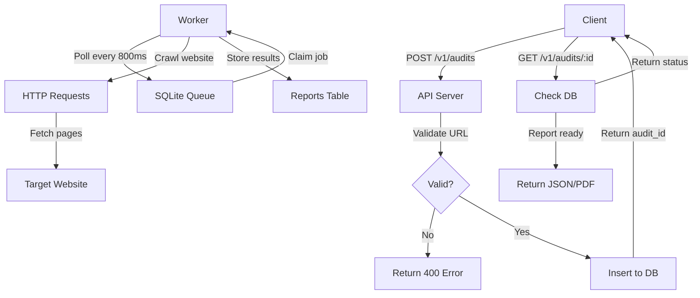
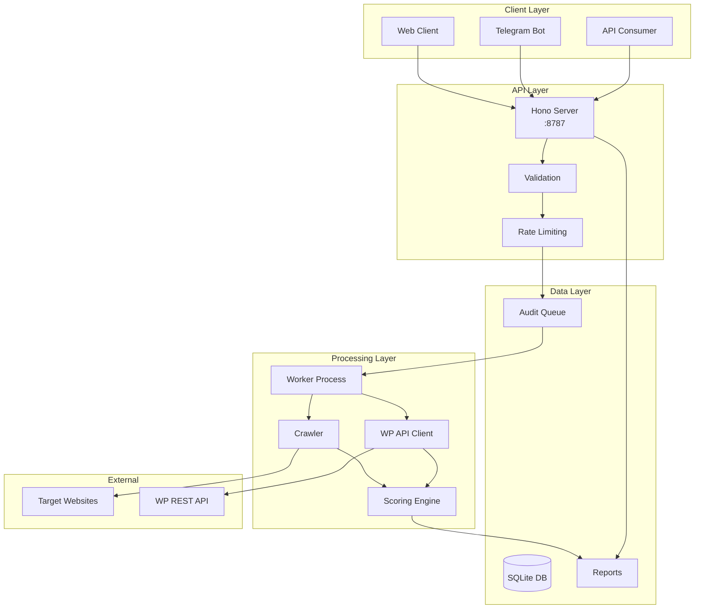
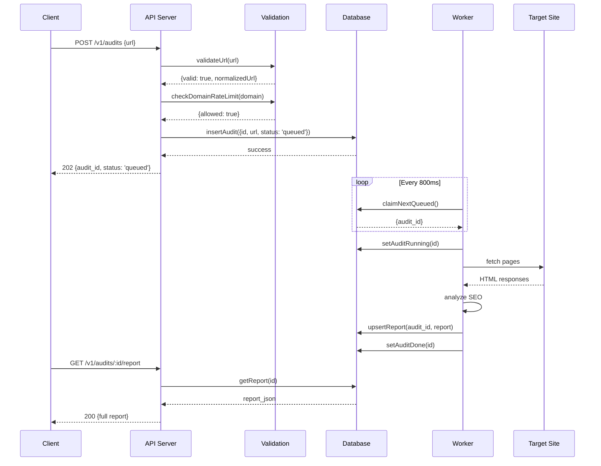

# SEO Audit Bot - Technical Documentation

**Project:** SEO Audit Bot  
**Version:** 3.0  
**Last Updated:** February 25, 2026  
**Author:** farahani  
**Repository:** https://github.com/farahaniamin/Seo-Audit-API  

---

## 1. Overview

### 1.1 What It Is
SEO Audit Bot is a production-ready SEO analysis service that performs comprehensive website audits. It crawls websites, analyzes technical SEO factors, integrates with WordPress REST API for enhanced insights, and generates actionable reports in multiple formats (JSON, PDF, Telegram).

### 1.2 Who It's For
- **SEO Agencies** - White-label SEO auditing for client websites
- **Website Owners** - Self-service SEO health checks
- **Developers** - API-first integration for custom SEO tools
- **Marketing Teams** - Content freshness and optimization tracking

### 1.3 How It Creates Value
- **Automated Audits** - Eliminates manual SEO checking
- **WordPress Integration** - Enhanced insights for WordPress sites via REST API
- **Actionable Reports** - Specific fix recommendations with time estimates
- **Bilingual Support** - Persian (FA) and English (EN) output
- **Scalable Architecture** - Handles concurrent audits with queue management

---

## 2. Goals & Non-Goals

### 2.1 Goals
- ✅ Provide comprehensive SEO audits (technical, on-page, content freshness)
- ✅ Support both smart sampling and full crawl modes
- ✅ Integrate with WordPress REST API for enhanced data
- ✅ Generate actionable recommendations with fix instructions
- ✅ Support bilingual output (FA/EN)
- ✅ Handle high concurrent load with proper rate limiting
- ✅ Provide real-time progress tracking
- ✅ Ensure data retention compliance (GDPR)

### 2.2 Non-Goals
- ❌ Real-time SEO monitoring (periodic audits only)
- ❌ Competitor analysis (out of scope)
- ❌ Backlink analysis (requires external APIs)
- ❌ JavaScript-rendered SPA crawling (basic HTML only)
- ❌ Mobile app (API-only service)

---

## 3. Users & Key Use-Cases

### 3.1 Primary Users

| User Type | Use Case | Success Criteria |
|-----------|----------|------------------|
| SEO Agency | Run monthly audits for 100+ client sites | < 3 min per site, actionable reports |
| WordPress Developer | Check site health before launch | WP API integration working, no false positives |
| Content Manager | Track content freshness | Freshness score accurate, stale content identified |
| DevOps Engineer | Monitor system health | Health endpoints responsive, queue manageable |

### 3.2 Key User Journeys

**Journey 1: First-Time Audit**
1. User submits URL via API
2. System validates URL and checks robots.txt
3. Audit queued and picked up by worker
4. Real-time progress updates via polling
5. Report generated with scores and recommendations
6. User downloads PDF or views JSON

**Journey 2: WordPress Site Analysis**
1. User submits WordPress site URL
2. System detects WP REST API availability
3. Fetches post types, content items, taxonomies
4. Calculates content freshness score
5. Identifies latest updated products/posts
6. Enhanced report with WP-specific insights

---

## 4. Tech Stack

| Layer | Technology | Purpose | Why Chosen | Alternatives |
|-------|-----------|---------|------------|--------------|
| **Runtime** | Node.js 18+ | JavaScript execution | ESM support, async/await | Deno, Bun |
| **Framework** | Hono | HTTP server | Lightweight, fast, middleware support | Express, Fastify |
| **Database** | SQLite 3 | Audit storage | Zero-config, WAL mode, single file | PostgreSQL, MySQL |
| **Language** | TypeScript | Type safety | Strict typing, better DX | JavaScript |
| **Queue** | SQLite + Polling | Job management | Simple, no external dependencies | Redis, RabbitMQ |
| **PDF** | pdfkit | Report generation | Flexible, Node-native | Puppeteer, wkhtmltopdf |
| **HTTP Client** | Native fetch | Web requests | No dependencies, modern | Axios, node-fetch |
| **Validation** | Zod | Schema validation | TypeScript-first, lightweight | Joi, Yup |
| **Process Mgmt** | Concurrently | Dev script running | Simple parallel processes | Docker Compose |

### 4.1 Runtime Versions
- **Node.js:** >= 18.0.0 (required for native fetch)
- **TypeScript:** 5.x
- **Package Manager:** npm 9+

---

## 5. Architecture

### 5.1 High-Level Description
Dual-process architecture with API server (HTTP) and worker (background processing). SQLite database serves as both data store and job queue. Both processes share the same database via WAL mode for concurrent access.

### 5.2 Component Breakdown

**API Server (`src/server.ts`)**
- HTTP endpoints for audit creation and retrieval
- Request validation (URL, rate limits)
- Health and metrics endpoints
- Synchronous responses only

**Worker (`src/worker.ts`)**
- Polling-based job consumer
- Executes audits asynchronously
- Updates progress in real-time
- Handles failures and retries

**Database (`src/db.ts`)**
- SQLite with WAL mode
- Two tables: `audits` and `reports`
- Indexes for performance
- Cleanup functions for data retention

**Audit Engine (`src/audit/`)**
- Crawling logic (`smart.ts`)
- WordPress API integration (`wpApi.ts`)
- Scoring algorithm (`score.ts`)
- Report generation (`pdf.ts`, `telegram.ts`)

### 5.3 Data Flow



### 5.4 Architecture Diagram



### 5.5 Sequence Diagram: Create Audit



### 5.6 Key Design Decisions

| Decision | Rationale | Tradeoff |
|----------|-----------|----------|
| **SQLite over PostgreSQL** | Zero-config, single file, sufficient for current scale | Not horizontally scalable |
| **Dual processes vs threads** | Isolation, crash recovery, simpler deployment | IPC complexity |
| **Polling vs WebSocket** | Simpler implementation, stateless | Higher latency updates |
| **Smart sampling default** | Faster results, lower resource usage | Less comprehensive than full crawl |
| **In-memory caching** | Speed, no external dependency | Cache lost on restart |

---

## 6. Repository Structure

```
seo-audit-bot/
├── src/
│   ├── server.ts                 # HTTP API server (Hono)
│   ├── worker.ts                 # Background job processor
│   ├── db.ts                     # Database operations & schema
│   ├── env.ts                    # Environment variable helpers
│   ├── types.ts                  # TypeScript type definitions
│   ├── audit/                    # Audit logic modules
│   │   ├── runAudit.ts          # Main audit orchestration
│   │   ├── smart.ts             # Smart sampling algorithm
│   │   ├── score.ts             # 5-pillar scoring algorithm
│   │   ├── wpApi.ts             # WordPress REST API client
│   │   ├── freshness.ts         # Content freshness analysis
│   │   ├── recommendations.ts   # Actionable fix recommendations
│   │   ├── validation.ts        # URL validation & rate limiting
│   │   ├── reliability.ts       # Retry logic, circuit breaker
│   │   ├── siteType.ts          # Site classification (ecommerce/etc)
│   │   ├── summary.ts           # Findings aggregation
│   │   ├── telegram.ts          # Telegram message formatting
│   │   ├── pdf.ts               # PDF report generation
│   │   ├── fetcher.ts           # HTTP request wrapper
│   │   ├── html.ts              # HTML parsing utilities
│   │   ├── sitemap.ts           # Sitemap parsing
│   │   ├── robots.ts            # robots.txt handling
│   │   ├── linkcheck.ts         # Link validation
│   │   └── url.ts               # URL normalization & utilities
│   ├── monitoring/              # Monitoring & health checks
│   │   └── health.ts            # Health check endpoints
│   └── utils/                   # Utilities
│       ├── cache.ts             # Report caching & rate limiting
│       └── i18n.ts              # Internationalization (FA/EN)
├── data/                        # SQLite database (gitignored)
├── dist/                        # Compiled JavaScript (build output)
├── .env.example                 # Environment variables template
├── .gitignore                   # Git ignore rules
├── package.json                 # Dependencies & scripts
├── tsconfig.json                # TypeScript configuration
├── README.md                    # User-facing documentation
├── AGENTS.md                    # Developer guidelines
├── SCORING.md                   # Scoring algorithm documentation
├── TEST.md                      # Test reports
└── v2.0-RELEASE.md             # Release notes
```

### 6.1 Where to Change X

| If you need to... | Go to... |
|-------------------|----------|
| Add new API endpoint | `src/server.ts` |
| Fix scoring algorithm | `src/audit/score.ts` |
| Add new validation rule | `src/audit/validation.ts` |
| Modify database schema | `src/db.ts` (initDb function) |
| Change crawl behavior | `src/audit/smart.ts` |
| Add WP API feature | `src/audit/wpApi.ts` |
| Update translations | `src/utils/i18n.ts` |
| Modify PDF layout | `src/audit/pdf.ts` |
| Add health check | `src/monitoring/health.ts` |
| Configure caching | `src/utils/cache.ts` |

---

## 7. Data Model

### 7.1 Entities

#### Table: `audits`
Stores audit jobs and their status.

| Column | Type | Constraints | Description |
|--------|------|-------------|-------------|
| id | TEXT | PRIMARY KEY | UUID v4 |
| requested_url | TEXT | NOT NULL | Original URL submitted |
| profile | TEXT | NOT NULL | 'smart' or 'full' |
| status | TEXT | NOT NULL | queued/running/done/failed |
| progress_stage | TEXT | | Current stage (robots, sitemap, crawl) |
| progress_value | INTEGER | | Pages crawled (0-total) |
| error_code | TEXT | | Error code if failed |
| error_message | TEXT | | Human-readable error |
| created_at | TEXT | NOT NULL | ISO 8601 timestamp |
| started_at | TEXT | | When worker picked up |
| finished_at | TEXT | | When completed/failed |
| limits_json | TEXT | | Serialized Limits object |
| user_context_json | TEXT | | User-provided context |

#### Table: `reports`
Stores completed audit reports.

| Column | Type | Constraints | Description |
|--------|------|-------------|-------------|
| audit_id | TEXT | PRIMARY KEY, FK | References audits.id |
| report_json | TEXT | NOT NULL | Full report JSON |
| created_at | TEXT | NOT NULL | ISO 8601 timestamp |

### 7.2 Relationships
```
audits (1) -----> (0..1) reports
     ↑
     |
   queue
```

### 7.3 Indexes
```sql
CREATE INDEX idx_audits_status ON audits(status);
CREATE INDEX idx_audits_created ON audits(created_at);
CREATE INDEX idx_audits_url ON audits(requested_url);
CREATE INDEX idx_audits_status_created ON audits(status, created_at);
```

### 7.4 Data Lifecycle

**Retention Policy:**
- Audits auto-deleted after 90 days (GDPR compliance)
- Cascading delete of reports
- Configurable via `DATA_RETENTION_DAYS` env var

**Cleanup:**
- Stale running audits (> 60 min) reset to queued
- Expired cache entries purged every 5 minutes

---

## 8. API Contract

### 8.1 Authentication
**Current:** No authentication (ASSUMPTION: Add API key or OAuth for production)

### 8.2 Rate Limiting
- **Per Domain:** 5 audits per minute
- **Global:** TBD (ASSUMPTION: Add rate limiting middleware)

### 8.3 Error Format
```json
{
  "error": {
    "code": "ERROR_CODE",
    "message": "Human readable description"
  }
}
```

### 8.4 Endpoints

#### POST /v1/audits
Create a new SEO audit.

**Authentication:** None (TBD)  
**Headers:**
- `Content-Type: application/json`

**Request Body:**

| Field | Type | Required | Description | Example |
|-------|------|----------|-------------|---------|
| url | string | Yes | URL to audit | "https://example.com" |
| profile | string | No | Audit mode | "smart" (default) or "full" |
| limits | object | No | Override defaults | See Limits type |
| user_context | object | No | Custom metadata | `{ "client_id": "123" }` |

**Example Request:**
```json
{
  "url": "https://mahoorab.com",
  "profile": "smart",
  "user_context": {
    "lang": "fa"
  }
}
```

**Example Success Response (202):**
```json
{
  "audit_id": "e4e43d47-d646-4c99-952f-9b2cc5461b6f",
  "status": "queued"
}
```

**Example Error Responses:**

400 Bad Request (Invalid URL):
```json
{
  "error": {
    "code": "BAD_REQUEST",
    "message": "URL must start with http:// or https://"
  }
}
```

429 Too Many Requests:
```json
{
  "error": {
    "code": "RATE_LIMITED",
    "message": "Rate limit exceeded for domain mahoorab.com. Retry after 45 seconds."
  }
}
```

**Status Codes:**
- 202 Accepted - Audit queued
- 400 Bad Request - Invalid input
- 429 Too Many Requests - Rate limit hit
- 500 Internal Server Error - Server error

---

#### GET /v1/audits/:id
Get audit status and progress.

**Path Parameters:**

| Name | Type | Description |
|------|------|-------------|
| id | string | Audit UUID |

**Example Success Response (200):**
```json
{
  "audit_id": "e4e43d47-d646-4c99-952f-9b2cc5461b6f",
  "url": "https://mahoorab.com",
  "profile": "smart",
  "status": "done",
  "progress": {
    "stage": "crawl",
    "value": 50
  },
  "error": null,
  "created_at": "2026-02-16T20:25:00.000Z",
  "started_at": "2026-02-16T20:25:05.000Z",
  "finished_at": "2026-02-16T20:27:12.000Z"
}
```

**Status Codes:**
- 200 OK
- 404 Not Found

---

#### GET /v1/audits/:id/report
Get full audit report.

**Path Parameters:**

| Name | Type | Description |
|------|------|-------------|
| id | string | Audit UUID |

**Example Success Response (200):**
```json
{
  "schema_version": "2.0",
  "audit_id": "e4e43d47-d646-4c99-952f-9b2cc5461b6f",
  "url": "https://mahoorab.com",
  "profile": "smart",
  "started_at": "2026-02-16T20:25:00.000Z",
  "finished_at": "2026-02-16T20:27:12.000Z",
  "duration_ms": 132000,
  "coverage": {
    "mode": "sample",
    "checked_pages": 50,
    "discovered_pages": 269,
    "estimated_total_pages": 136
  },
  "pages": [...],
  "scores": {
    "overall": 87.4,
    "grade": "B",
    "site_type": "ecommerce",
    "pillars": {
      "indexability": 95.2,
      "crawlability": 87.4,
      "onpage": 81.3,
      "technical": 72.8,
      "freshness": 37.0
    }
  },
  "findings": [...],
  "top_issues": ["E06", "G01", "E04"],
  "quick_wins": ["E06", "F07", "F04"],
  "wp_api": {
    "available": true,
    "postTypes": {
      "post": 76,
      "page": 11,
      "product": 48
    },
    "totalItems": 136
  },
  "freshness": {
    "score": 37,
    "stale_count": 86,
    "freshness_grade": "F",
    "latest_products": [...],
    "latest_posts": [...]
  }
}
```

**Error Response (409 - Not Ready):**
```json
{
  "error": {
    "code": "NOT_READY",
    "message": "Report not ready"
  }
}
```

**Status Codes:**
- 200 OK
- 404 Not Found
- 409 Conflict - Audit still running

---

#### GET /v1/audits/:id/report.pdf
Download PDF report.

**Query Parameters:**

| Name | Type | Required | Description |
|------|------|----------|-------------|
| lang | string | No | 'fa' or 'en' (default: 'en') |

**Response:** `application/pdf` file download

---

#### GET /v1/audits/:id/telegram
Get Telegram-formatted summary.

**Query Parameters:**

| Name | Type | Required | Description |
|------|------|----------|-------------|
| lang | string | No | 'fa' or 'en' |

**Example Response:**
```json
{
  "audit_id": "e4e43d47-d646-4c99-952f-9b2cc5461b6f",
  "lang": "fa",
  "text": "📊 گزارش سئو...",
  "overall_score": 87.4,
  "coverage": {...},
  "pdf_url": "/v1/audits/.../report.pdf?lang=fa"
}
```

---

#### GET /health
System health check.

**Response:**
```json
{
  "status": "healthy",
  "checks": {
    "database": true,
    "diskSpace": true,
    "memory": true,
    "workerQueue": true
  },
  "details": {
    "databaseLatency": 105,
    "diskUsagePercent": 50,
    "queueSize": 0
  },
  "timestamp": "2026-02-16T20:28:37.395Z"
}
```

---

#### GET /metrics
System metrics.

**Response:**
```json
{
  "auditsTotal": 14,
  "auditsQueued": 0,
  "auditsRunning": 0,
  "auditsCompleted": 13,
  "auditsFailed": 1
}
```

---

## 9. Security & Privacy

### 9.1 Threats & Mitigations

| Threat | Mitigation | Status |
|--------|-----------|--------|
| **Private IP scanning** | Block localhost, 192.168.x.x, 10.x.x.x | ✅ Implemented |
| ** robots.txt bypass** | Check and respect robots.txt | ✅ Implemented |
| **Rate limiting bypass** | Domain-level rate limiting | ✅ Implemented |
| **SQL Injection** | Parameterized queries (better-sqlite3) | ✅ Protected |
| **XSS** | Output not rendered in browser | N/A |
| **Data retention** | Auto-delete after 90 days | ✅ Implemented |

### 9.2 Secrets Handling
Environment variables for:
- `DB_PATH` - Database location
- `PORT` - Server port
- `CACHE_TTL_MS` - Cache duration
- (TBD) API keys for authentication

### 9.3 Data Protection
- GDPR compliant (data retention policies)
- No PII stored in reports (ASSUMPTION: Verify)
- SQLite file permissions should be restrictive (600)

---

## 10. Performance & Scalability

### 10.1 Expected Load
(ASSUMPTION: Based on current single-instance setup)
- **Concurrent Audits:** 4 (global_concurrency)
- **Per-Host Concurrency:** 1 (polite crawling)
- **Max Pages:** 120 per audit (full mode)
- **Queue Size:** < 100 (alert threshold)

### 10.2 Caching Strategy
- **Report Cache:** 1 hour TTL
- **In-Memory:** Lost on restart
- **Key:** MD5(url + profile)

### 10.3 Background Jobs
- **Worker Polling:** Every 800ms
- **Stale Cleanup:** Every 5 minutes
- **Data Retention:** Daily cleanup of 90+ day old audits

### 10.4 Bottlenecks & Mitigation

| Bottleneck | Impact | Mitigation |
|------------|--------|------------|
| **SQLite single file** | Write contention | WAL mode enables concurrent reads |
| **Single worker process** | Throughput limit | Can scale horizontally (shared DB) |
| **Network I/O** | Slow crawls | Concurrent fetches (p-queue) |
| **Memory** | Large reports | Streaming PDF generation (TBD) |

---

## 11. Observability

### 11.1 Logging
- Console logging only (ASSUMPTION: Add structured logging)
- Key events: audit start/complete, errors, retries

### 11.2 Metrics
Available via `/metrics`:
- Total audits
- Status breakdown (queued/running/done/failed)
- Database latency
- Queue depth

### 11.3 Health Checks
- `/healthz` - Simple liveness (200 = alive)
- `/health` - Full health with component status
- Database connectivity
- Disk space
- Memory usage

### 11.4 Alerts (TBD)
(ASSUMPTION: Integrate with PagerDuty/Opsgenie)
- Queue size > 100
- Error rate > 5%
- Worker down > 5 minutes

---

## 12. Configuration

### 12.1 Environment Variables

| Name | Required | Default | Description |
|------|----------|---------|-------------|
| `DB_PATH` | No | `./data/app.db` | SQLite database file path |
| `PORT` | No | `8787` | HTTP server port |
| `CACHE_TTL_MS` | No | `3600000` | Report cache TTL (1 hour) |
| `DATA_RETENTION_DAYS` | No | `90` | Audit retention period |
| `DEFAULT_SAMPLE_TOTAL_PAGES` | No | `50` | Smart mode page count |
| `DEFAULT_REQUEST_DELAY_MS` | No | `1100` | Delay between requests |
| `DEFAULT_PER_HOST_CONCURRENCY` | No | `1` | Parallel requests per host |
| `DEFAULT_GLOBAL_CONCURRENCY` | No | `4` | Total parallel fetches |

### 12.2 Feature Flags
(TBD - Add feature flag system for gradual rollouts)

---

## 13. Local Development

### 13.1 Prerequisites
- Node.js >= 18
- npm >= 9
- Git

### 13.2 Setup
```bash
# Clone repository
git clone https://github.com/farahaniamin/Seo-Audit-API.git
cd Seo-Audit-API

# Install dependencies
npm install

# Setup environment
cp .env.example .env
# Edit .env if needed

# Create data directory
mkdir -p data
```

### 13.3 Run Commands
```bash
# Development (requires 2 terminals)
npm run dev:api      # Terminal 1: API server
npm run dev:worker   # Terminal 2: Worker

# Production build
npm run build
npm run start:api
npm run start:worker

# Linting
npm run lint
npx eslint . --ext .ts --fix
```

### 13.4 Test Data
```bash
# Create test audit
curl -X POST http://localhost:8787/v1/audits \
  -H "Content-Type: application/json" \
  -d '{"url": "https://example.com", "profile": "smart"}'
```

### 13.5 Common Pitfalls
- **Both processes must run:** API alone won't process audits
- **Port 8787 in use:** Change PORT in .env
- **SQLite locked:** Kill stale processes
- **Worker not picking up jobs:** Check if process is running

---

## 14. Testing

### 14.1 Test Types
(TBD - No test framework currently configured)

**Recommended:**
- Unit tests (Jest/Vitest)
- Integration tests (Supertest)
- E2E tests (Playwright)

### 14.2 Manual Testing
```bash
# Health check
curl http://localhost:8787/health

# Create audit
curl -X POST http://localhost:8787/v1/audits \
  -d '{"url": "https://mahoorab.com"}'

# Check status
curl http://localhost:8787/v1/audits/<audit_id>

# Get report
curl http://localhost:8787/v1/audits/<audit_id>/report
```

### 14.3 CI Notes
(TBD - Add GitHub Actions workflow)
- Run lint on PR
- Run type check (`tsc --noEmit`)
- Build verification

---

## 15. Deployment

### 15.1 Environments
- **Development:** Local machine
- **Staging:** (TBD)
- **Production:** (TBD)

### 15.2 Build/Release
```bash
# Build
npm run build

# Output in dist/ directory
# Deploy dist/ + package.json + .env
```

### 15.3 Deployment Options

**Option 1: Docker (Recommended)**
(TBD - Create Dockerfile)

**Option 2: PM2**
```bash
npm install -g pm2
pm2 start dist/server.js --name seo-api
pm2 start dist/worker.js --name seo-worker
```

**Option 3: Systemd**
(TBD - Create service files)

### 15.4 Rollback Strategy
- Keep previous release binary
- Database migrations are backward compatible (additive only)
- Blue-green deployment (TBD)

### 15.5 Database Migrations
SQLite schema is auto-created on startup. For changes:
1. Add new columns as nullable
2. Run data migration in code
3. Make columns required in next release

---

## 16. Troubleshooting / FAQ

### Q: Worker not processing audits
**A:** 
1. Check worker is running: `ps aux | grep worker`
2. Check database: `sqlite3 data/app.db "SELECT * FROM audits WHERE status='queued'"`
3. Restart worker

### Q: "Rate limit exceeded" error
**A:** Wait for the retry-after period, or configure higher limits in .env

### Q: PDF generation fails
**A:** Check memory usage, large reports may need more RAM

### Q: WordPress API not detected
**A:** Check if `/wp-json/wp/v2/types` is accessible (may be blocked)

---

## 17. Roadmap

### 17.1 Planned Improvements
- [ ] TTFB (Time to First Byte) tracking
- [ ] Internal link graph analysis (orphan page detection)
- [ ] Structured data validation (Schema.org)
- [ ] JavaScript rendering support (headless browser)
- [ ] Competitor analysis
- [ ] Real-time WebSocket updates
- [ ] Authentication & API keys
- [ ] Docker containerization
- [ ] Kubernetes deployment manifests

### 17.2 Known Limitations
- Single SQLite file (vertical scaling only)
- No JavaScript execution (SPA sites not fully supported)
- No real-time monitoring (batch audits only)
- Limited to HTTP/HTTPS (no FTP, etc.)

---

## 18. Glossary

| Term | Definition |
|------|------------|
| **Audit** | Complete SEO analysis of a website |
| **Smart Mode** | Sample-based audit (50 pages) |
| **Full Mode** | Comprehensive audit (120 pages) |
| **Freshness** | How recently content was updated |
| **WP API** | WordPress REST API integration |
| **Finding** | Individual SEO issue detected |
| **Pillar** | Category of SEO factors (Indexability, Crawlability, etc.) |
| **Queue** | SQLite table storing pending audits |
| **WAL Mode** | Write-Ahead Logging for SQLite concurrency |

---

## 19. Decision Log (Mini ADR)

### ADR-001: SQLite over PostgreSQL
**Decision:** Use SQLite for MVP  
**Context:** Need zero-config setup for easy deployment  
**Consequences:** 
- (+) No external dependencies
- (+) Single file, easy backup
- (-) No horizontal scaling
- (-) Write contention under heavy load  
**Status:** Accepted for v1-v2, reconsider for v3

### ADR-002: Dual Process Architecture
**Decision:** Separate API and Worker processes  
**Context:** Need isolation between HTTP and background processing  
**Consequences:**
- (+) Crash isolation
- (+) Independent scaling
- (-) IPC complexity
- (-) Need process manager  
**Status:** Accepted

### ADR-003: Smart Sampling Default
**Decision:** Make "smart" mode the default (50 pages)  
**Context:** Balance speed vs comprehensiveness  
**Consequences:**
- (+) Faster results
- (+) Lower resource usage
- (-) May miss edge cases on large sites  
**Status:** Accepted

---

## 20. Missing Info / Questions

### Essential Questions for Production
1. **Authentication:** What auth strategy? (API keys, OAuth, JWT?)
2. **SLA Requirements:** What uptime %? Response time SLA?
3. **Scaling:** Expected audits per day? Peak load?
4. **Monitoring:** Preferred observability stack? (Datadog, New Relic, CloudWatch?)
5. **Compliance:** Any specific compliance needs beyond GDPR?
6. **Multi-tenancy:** Single tenant or multiple organizations?
7. **Pricing:** Free tier, paid tiers, usage-based?

### Technical Debt
1. Add comprehensive test suite
2. Structured logging (Winston/Pino)
3. Docker containerization
4. CI/CD pipeline
5. Database migration system

---

## 21. Appendix: Deep Dives (Critical Files)

### A.1 src/audit/score.ts - Scoring Algorithm
**What it does:** Calculates 5-pillar SEO scores  
**Key Inputs:** 
- Pages array with issues
- Freshness data (optional)
- Site type  
**Key Outputs:**
- Overall score (0-100)
- Grade (A-F)
- Pillar breakdowns

**Algorithm:**
```
For each issue:
  penalty = weight × severity_mult × ratio_factor
  
ratio_factor = 0.2 + 2.0 × (ratio ^ 0.75)

Final score = 100 - sum(all penalties)
Weighted by pillar weights
```

### A.2 src/audit/wpApi.ts - WordPress Integration
**What it does:** Detects and fetches WordPress REST API data  
**Key Inputs:** Origin URL  
**Key Outputs:**
- Post type distribution
- Content items with dates
- Taxonomies

**Rate Limiting:** 600ms between requests, max 1000 items  
**Endpoint Used:** `/wp-json/wp/v2/types` (lightweight, 25KB vs 2.4MB root)

### A.3 src/audit/reliability.ts - Error Handling
**What it does:** Retry logic, circuit breaker, throttling  
**Key Components:**
- `withRetry()` - Exponential backoff wrapper
- `CircuitBreaker` - Prevents cascading failures
- `AutoThrottler` - Handles 429 errors

**Usage:**
```typescript
const result = await withRetry(
  () => fetchHtml(url),
  { maxRetries: 3, baseDelay: 1000 }
);
```

### A.4 src/db.ts - Database Layer
**What it does:** All database operations  
**Key Functions:**
- `initDb()` - Schema creation
- `insertAudit()` - Queue job
- `claimNextQueued()` - Atomic job claiming
- `deleteOldAudits()` - Data retention

**Schema Version:** Implicit (no migrations table yet)

---

**End of Document**

*For updates, see GitHub repository: https://github.com/farahaniamin/Seo-Audit-API*
